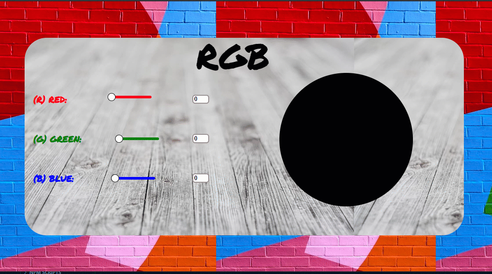

<h1 align="center"> RGB - Seleção de Cores<h1>
<h1>  <h1>

# Indice
- [Sobre](#-sobre)
- [Tópicos importantes](#-tópicos-importantes)
- [Tecnologias utilizadas](#-tecnologias-utilizadas)
- [Como baixar o projeto](#-como-baixar-o-projeto)

---

# 📋 Sobre
Projeto **RGB** é uma atividade pratica desenvolvida como sugestão de exercicio do **Bootcamp IGTI** de desenvolvimento fullstack.

O projeto possui um range para seleção de cores e uma paleta com as cores correspondentes.

E a página receitas com todas as receitas do site disposta através do conceito de  **grids**


##  ❗ Tópicos Importantes
- [DOM](https://www.w3schools.com/js/js_htmldom.asp)
- [Seletores CSS](https://developer.mozilla.org/pt-BR/docs/Web/CSS/Getting_Started/Seletores)

---

## 🚀 Tecnologias utilizadas 

O projeto foi desenvolvido utilizando as seguintes tecnologias:

- [HTML](https://www.w3schools.com/html/)
- [CSS](https://www.w3schools.com/css/default.asp)
- [Javascript](https://www.w3schools.com/js/default.asp)


---

## 📁 Como baixar o projeto
```bash

    #Clonar repositório
    $ git clone https://github.com/JayG32/rgb

     #Entre na pasta do projeto
    cd rgb

    #Instale as dependencias
    npm install

    #Execute a aplicação
    npm start

```

---
Termos da licença MIT  |  Desenvolvido por 👩‍💻 Janiele Nogueira